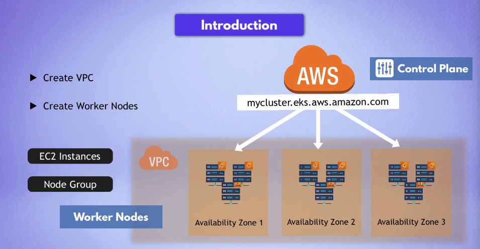
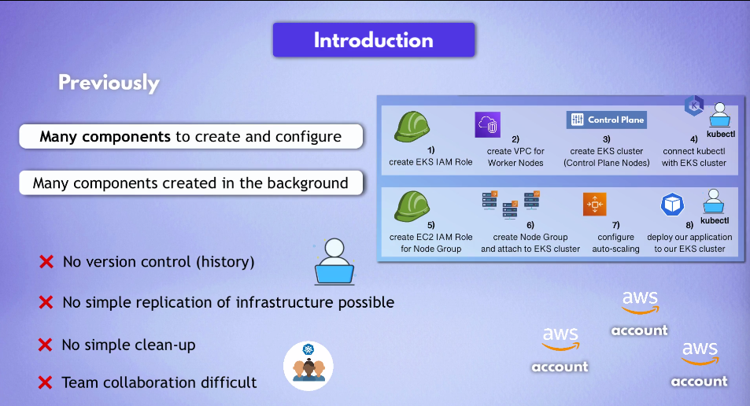
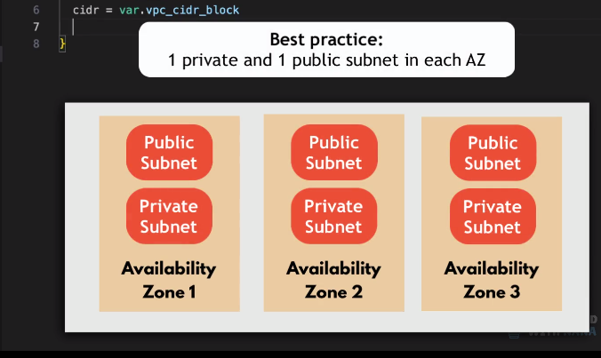
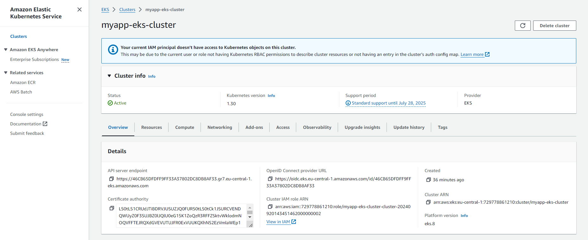
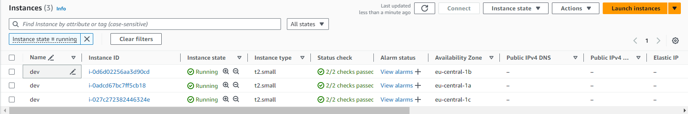
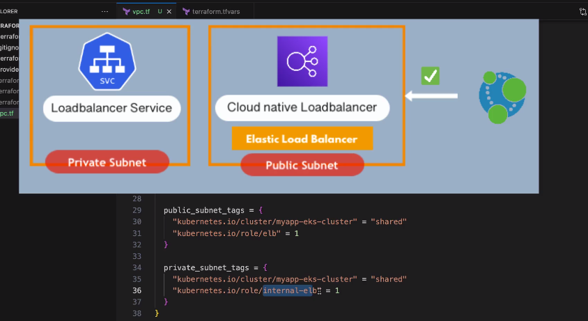
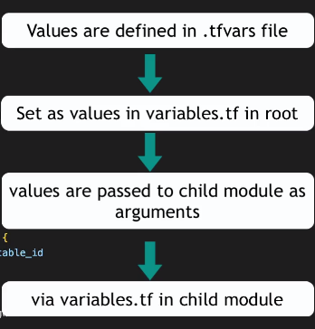

# Automate creation of EKS cluster using Terraform.
<div align="center">
  
</div>

## Cluster Service needs to be created.
<div align="center">
  
</div>

- we need something like CloudFormation template

-> When your using module run 'terraform init'


##### Pre-Requisites
1. AWS CLI installed
2. kubectl installed
3. aws-iam-authenticator installed

```
aws eks update-kubeconfig --name myapp-eks-cluster --region eu-central-1
```

```
kubectl get nodes
```

```
kubectl apply
```

## Best Practices of Subnet and VPC

<div align="center">
  
</div>

## EKS cluster is created.
<div align="center">
  
</div>

## Node-Group Created.
<div align="center">
  
</div>

## Note of Public and Private
<div align="center">
  
</div>

## How values are passed from module.
<div align="center">
  
</div>