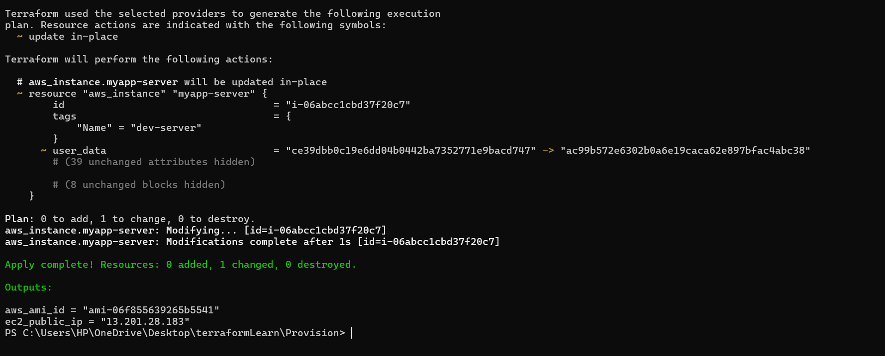
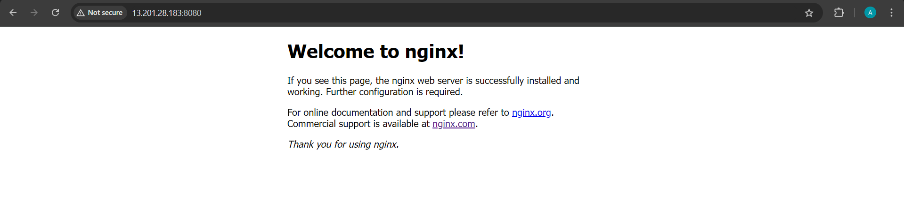

# 3-types of provisioner

## 1."remote-exec"  provisioner

-invokes script on remote resources after it is created

```
provisioner "remote-exec"{  // provisioner
  inline = [
    "export ENV = dev",
    "mkdir newdir"
  ]
}
```

above command execute in ec2 instance


## 2. "file" provisioner  => Copy files or directories from local to newly created resources.

```
provisioner "file" {     // copy the file to a remote server from local machine
  source = "entry-script.sh"
  destination = "/home/ec2-user/entry-script-on-ec2.sh"
}
```

source = source file or folder
destination - absolute path

## 3. "local-exec" provisioner
- invokes a local executable after a resource is created

```
provisioner "local-exec"{    // no need connection
  command = "echo ${self.public_ip} > output.txt"
}
```

###### Provisioners are not recommended by Terraform

## user_data is recommended for initial script execute.It breaks the idempontency concept.

Idempontency --> is like how many time you execute the script the output result is same it never changes.

####  Alternative to remote-exec
- Use configuration management tools. (puppet , ansible, Chef).


###### Exection Result.
<div align="center">
  
</div>

###### File is copies and executed in remotes server.
<div align="center">
  
</div>