# TERRAFORM

<div align="center">
  
</div>

### Download the terrform with this link https://releases.hashicorp.com/terraform/1.9.5/terraform_1.9.5_windows_386.zip.
### Extract the file.
### Copy the 'terraform' path and enter the 'edit the enviroment file in edit path section give the file name'.

<div align="center">
  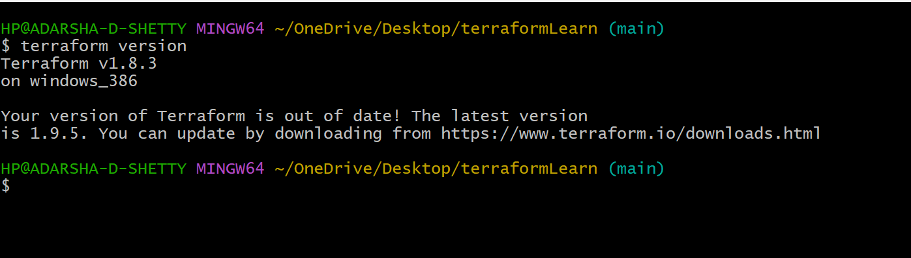
</div>

### Terraform Providers  (aws ,azure ,Google) https://registry.terraform.io/browse/providers
Here we are using AWS Providers.

##### After 'terraform apply' terraform.tfstate file will created , which track main.tf file.
<div align="center">
  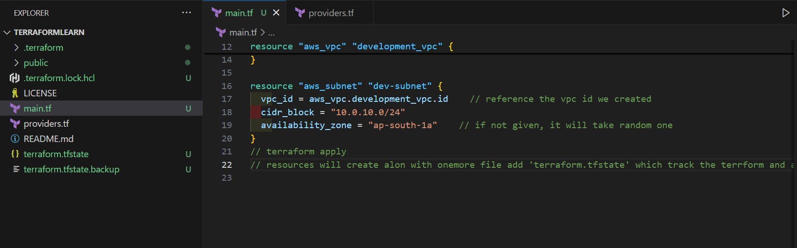
</div>

##### 'execution result' , which will create vpc , subnet , and subnet under the default vpc.
<div align="center">
  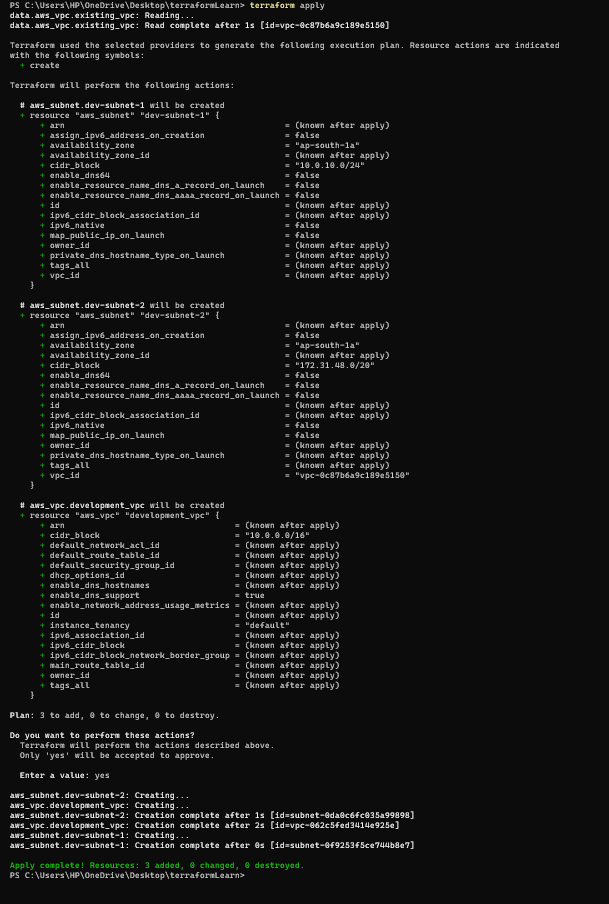
</div>

#####  Success subnet under vpc is created.
<div align="center">
  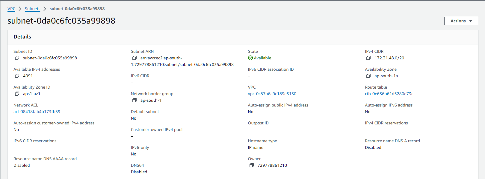
</div>

##### If we apply terraform 2 time terraform just refresh the main.tf and see any changes in the main.tf
<div align="center">
  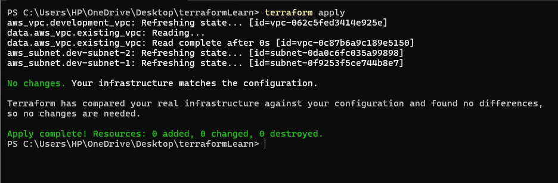
</div>

##### After apply main.tf . Following operation will take place.
<div align="center">
  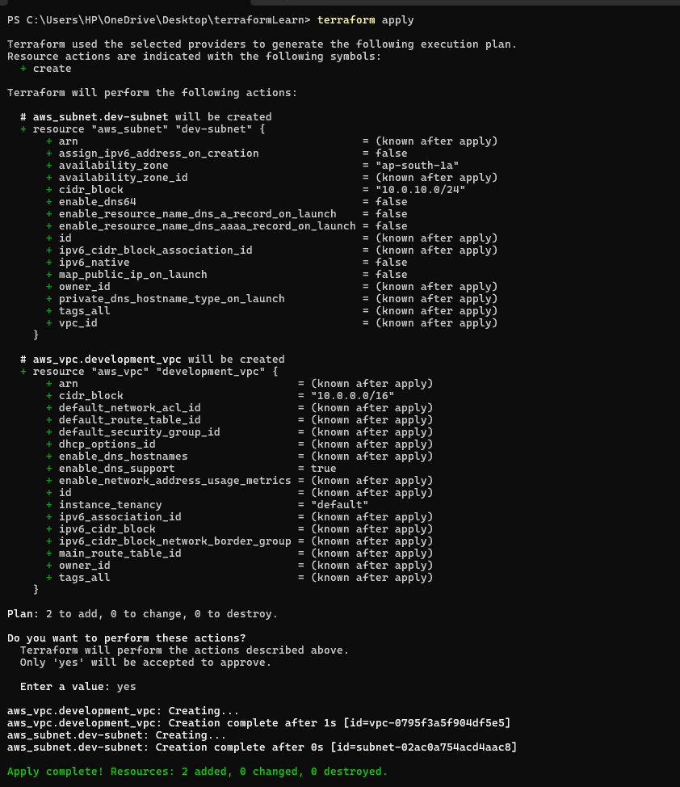
</div>

# Data
Which will query the already existing resources in the AWS.


# Give Names to resources  'tags = key-value pairs in aws'
Terraform reads the current state and modify that state.

##### After adding tags execution
<div align="center">
  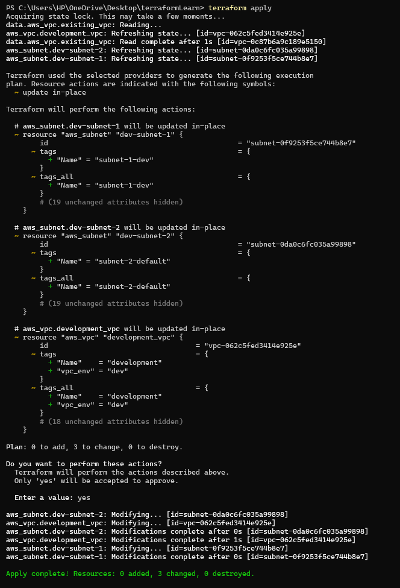
</div>

##### VPC tag is also upadated.
<div align="center">
  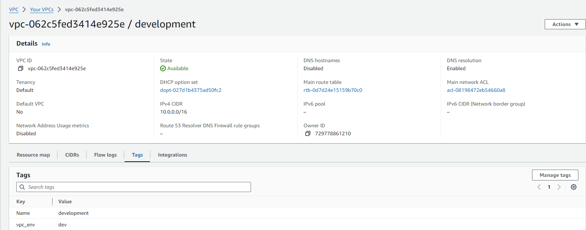
</div>

##### Subnet name is upadated.
<div align="center">
  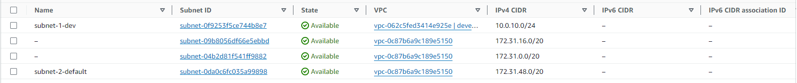
</div>

#### Destroying the resources or removing ('terraform destroy')  in execution it highlighted as red -

```
terraform destroy -target aws_subnet.dev-subnet-2 
```
Which will remove the targeted or specific resources.

--> Always apply Terraform cinfig file Especially when working in a team

##### More Terraform Commands

Diffrenece between currentState and desiredState

```
terraform plan
```

To remove all the resources 

```
terraform destroy -auto-approve
```

No need to give the confirmation
```
terraform apply -auto-approve
```

##### Terraform State
'terraform.tfstate.backup' file keep track of the terraform operation in the background.

```
terraform state
```
<div align="center">
  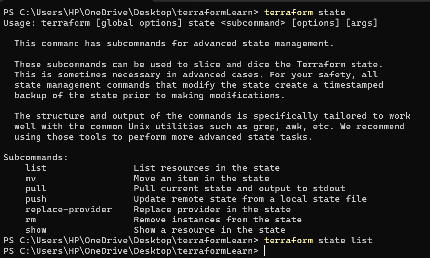
</div>

```
terraform state list
```
<div align="center">
  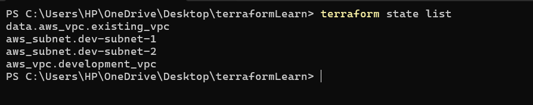
</div>


### OutPut Values
After 'terraform apply -auto-approve'

<div align="center">
  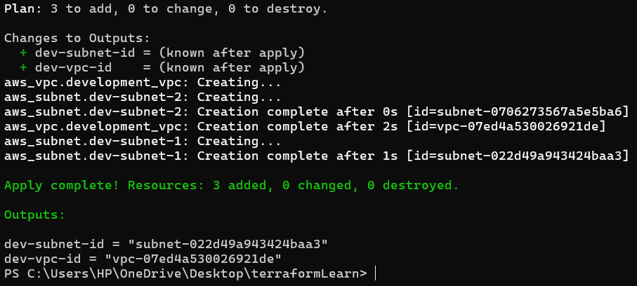
</div>


#### Variable 
Like using same template for prod and dev enviroment

#### Three ways to pass value to the input variable. 
1. When 'terraform apply' 
But this is not a effiecient way

2. Passing variable through CMD promt
```
terraform apply -var "subnet_cidr_block=10.0.30.0/24"
```

3. Best practice is 'defining variable file' most of the cases we use this method only 'terraform.tfvars'

Replicate same infrastructure for different environments
Like we can use same main.tf file can be used in DEV , STAGING,PROD environment. With 'terraform.vars' file.

If change the file name from 'terraform.tfvars' to terraform-dev.tfvars 
```
terraform apply
```
It promt

Instead we can also use 

```
terraform apply -var-file terraform-dev.tfvars
```

## Variable Default Values

## Type Constraints
Type specifies what value types are accepted

## Objects in string