# S3 With Terraform

1. How to Create Bucket ?
2. How to upload multiple Objects in S3 Bucket ?
3. S3 KMS Keys and Encryption (Enable the security)
4. Custom IAM Policy on S3
5. Versioning on S3 Object
6. LifeCycle Rule on S3 Object 
7. Bucket Logging 
8. Object Lock6

## All the Result

#### S3 Bucket Created

  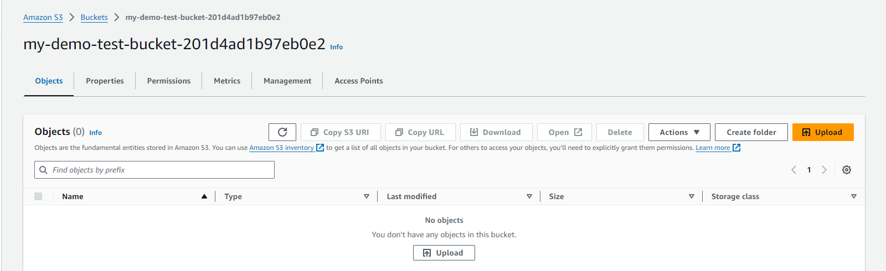

#### Files are uploaded to a S3 bucket

  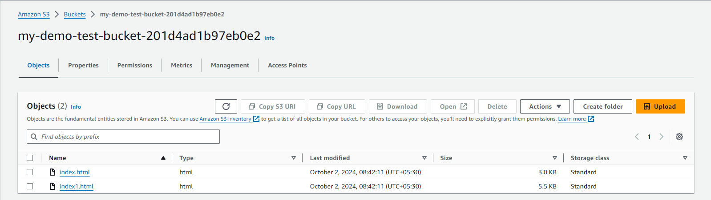

#### KMS (Key Management Service) Created

  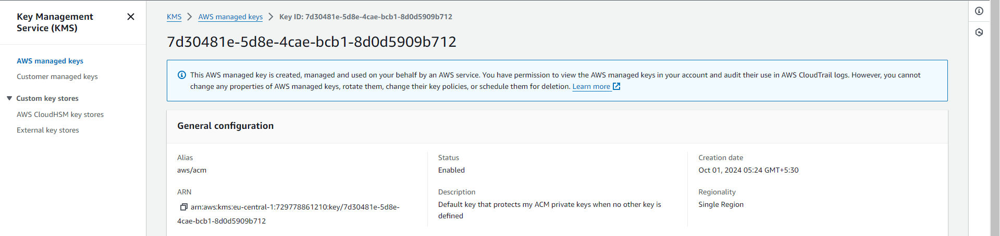

#### KMS Key Attached to a S3 Bucket

  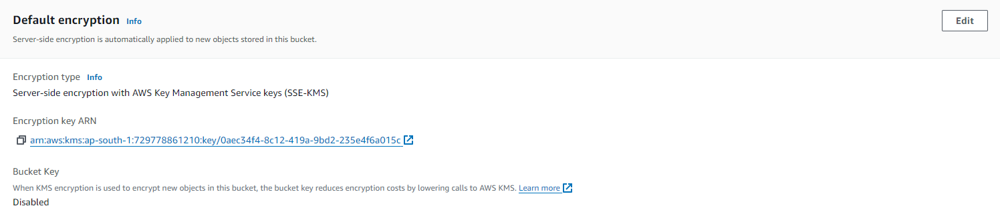

#### S3 Bucket Policy Created And Applied

  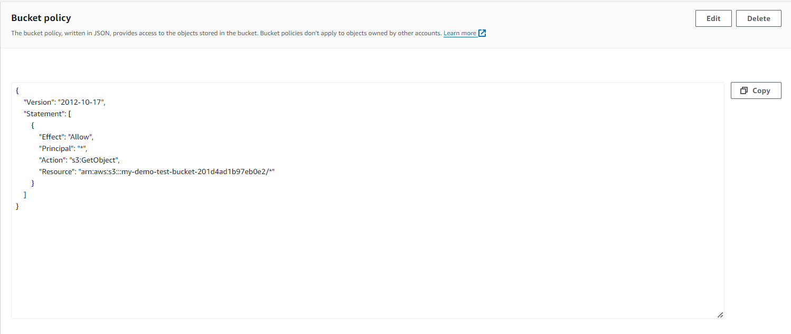

#### Bucket Versioning is enabled to S3 Bucket

  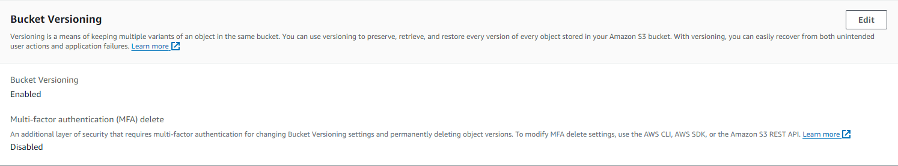

#### Result For Bucket Versioning 

  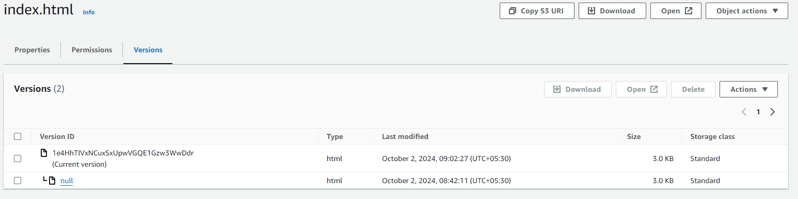

#### Bucket Life Cycle Before Emepty

  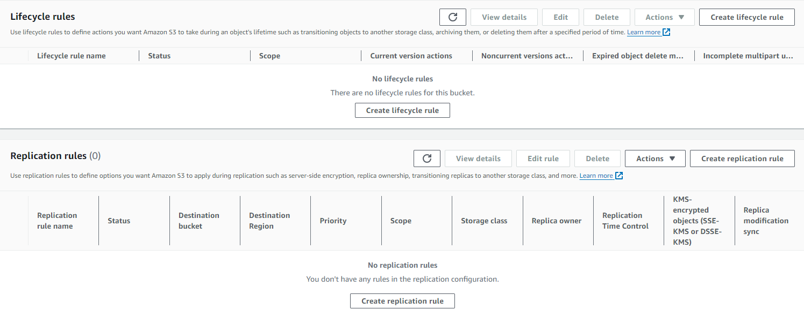

#### Bucket Life Cycle Applied

  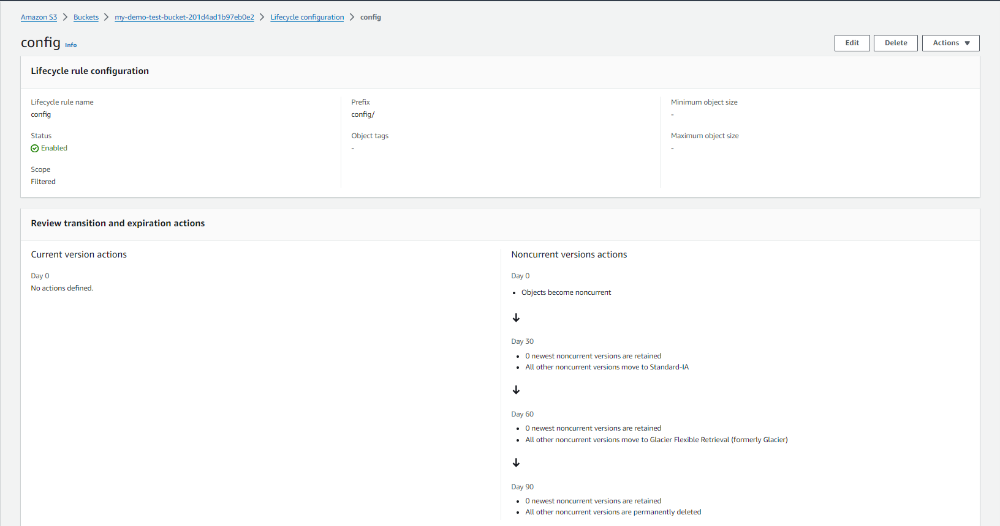

#### S3 Bucket is created for logging

  

#### S3 log bucket attached to a bucket

  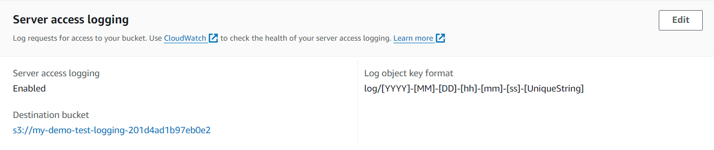

#### Object Lock is applied to Bucket 

  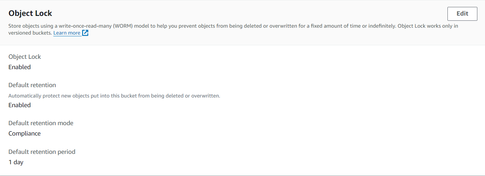

