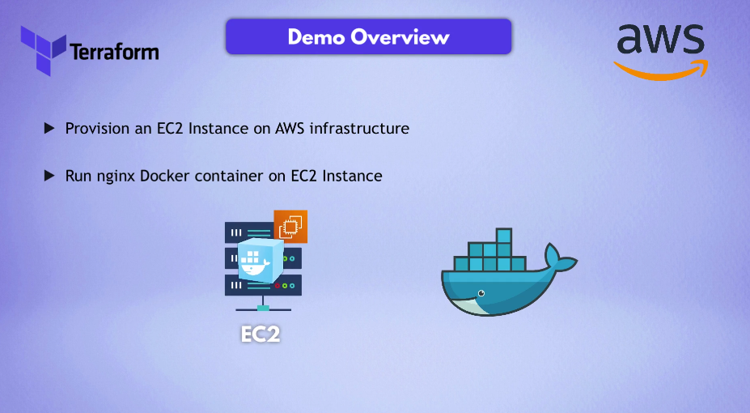
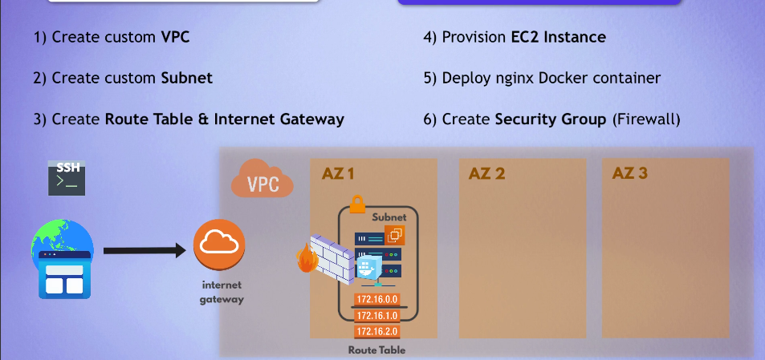
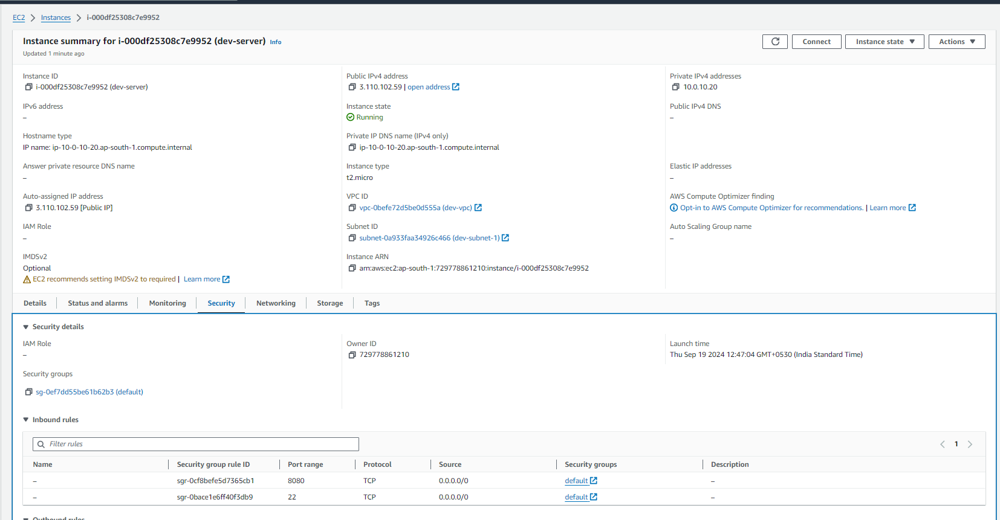
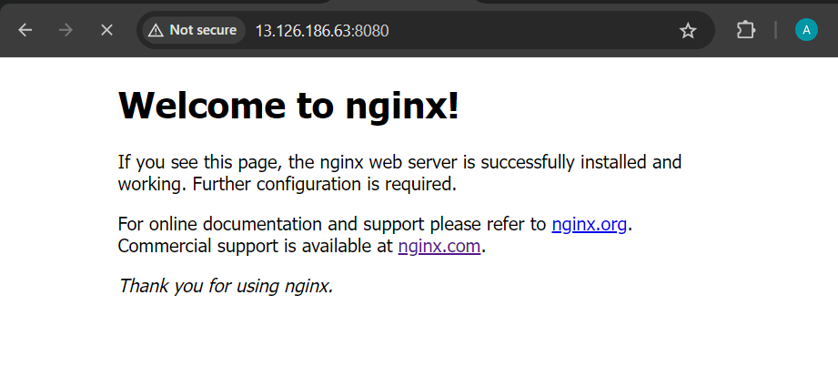

#### Project Overview
<div align="center">
  
</div>
1. Provision an EC2 Instance on AWS infrastructure
2. Run nginx Docker container on EC2 Insance

## Before this Provision AWS infrastructure for it.

1. Create custom VPC
2. Create custom Subnet
3. Create Route Table & Internet Gateway
4. Provision EC2 Instance
5. Deploy nginx Docker container
6. Create SG (firewall)

#### Project Steps
<div align="center">
  
</div>


###### (AWS create default route table when we are creating vpc)

```
terraform state show aws_vpc.myapp-vpc
```

## Configure the pem (key value pair)
```
ssh-keygen
```
###### public_key_location =  "C:/Users/HP/.ssh/id_rsa.pub"

1. icacls "C:\Users\HP\.ssh\id_rsa.pub" /grant HP:R   (Set the execution permission in CMD Not work in GIT BASH)
2. ssh -i ~/.ssh/id_rsa ec2-user@43.205.103.181
3. ssh ec2-user@43.205.103.181


## VPC , SubNet , SG  Created as in main.tf
<div align="center">
  
</div>

## Final Result "Nginx server deployed through Docker container"
<div align="center">
  
</div>